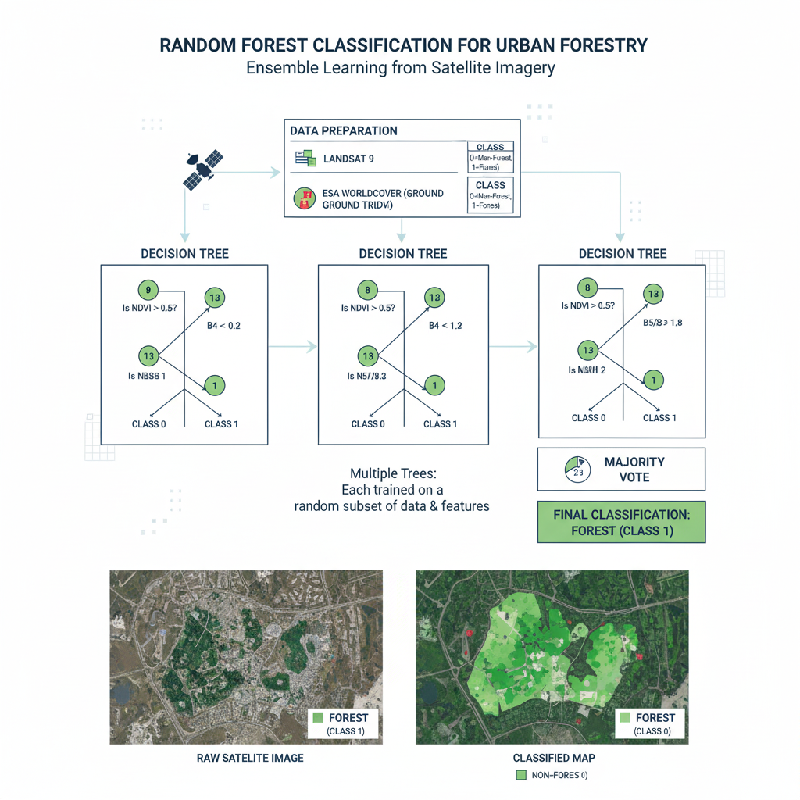
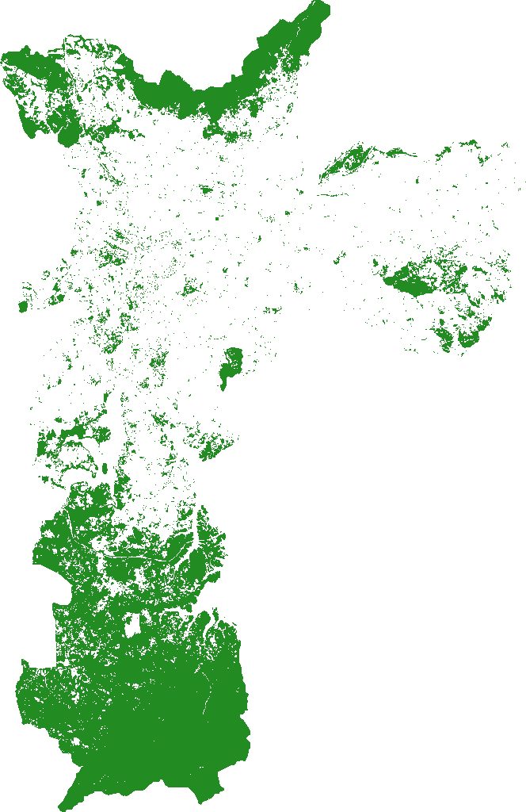
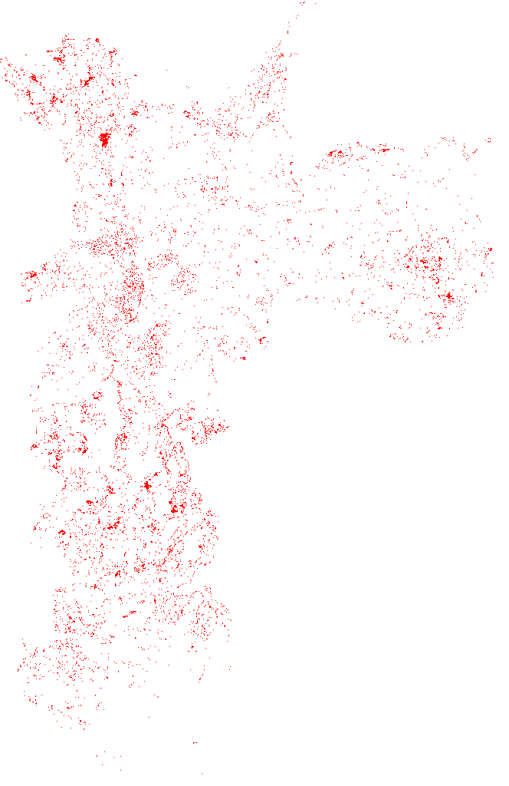
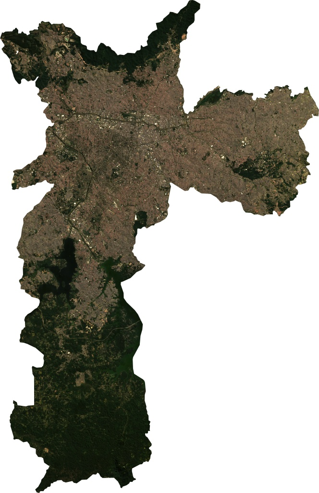

# ForestEyes: Monitoramento da Floresta Urbana em SP

O **ForestEyes** é um pipeline automatizado de sensoriamento remoto desenvolvido para monitorar a supressão e a dinâmica da vegetação urbana no município de São Paulo. Utilizando a API do Google Earth Engine (GEE) - o sistema processa imagens de satélite Landsat 8/9 para classificar a cobertura vegetal e quantificar perdas anuais.

## 🛠️ Tecnologias Utilizadas
* **Google Earth Engine (GEE):** Processamento de imagens de satélite em nuvem.
* **Python 3:** Linguagem principal do pipeline.
* **Geemap:** Biblioteca para integração entre GEE e fluxos de trabalho locais (Shapefiles/Raster).
* **Random Forest:** Algoritmo de aprendizado de máquina para classificação supervisionada.
* **ESA WorldCover v200:** Dataset de referência (*Ground Truth*) para validação da vegetação.

## 📋 Funcionalidades
1. **Pipeline de Dados:** Ingestão automatizada e pré-processamento radiométrico de imagens Landsat.
2. **Classificação:** Algoritmo Random Forest treinado via *Ground Truth* do ESA.
3. **Métricas de Impacto:** Cálculo automático de área desmatada (hectares) e Índice Kappa (acurácia).
4. **Exportação:**
   * **Raster (PNG/JPG):** Mapas visualmente interpretáveis (fundo branco ou transparente).
   * **Vetor (SHP):** Shapefiles precisos para uso em softwares de SIG (QGIS/ArcGIS).

## 📊 Processos Exportados (Shapefiles)
O script gera as seguintes camadas vetoriais fundamentais para análise:
1. **Segmentação (SNIC):** Agrupamento de pixels (*superpixels*).
2. **Classificação Final:** Mapa completo da cobertura.
3. **Ground Truth (ESA):** Referência usada para o treino.
4. **Distribuição Floresta (2018/2024):** Evolução da cobertura.
5. **Monitoramento de Desmatamento:** Polígonos de supressão detectada.

## 🚀 Como Executar
1. **Pré-requisitos:**
   * Conta no [Google Earth Engine](https://earthengine.google.com/).
   * Python instalado.
   * Bibliotecas: `pip install earthengine-api geemap geopandas pyshp pandas`.
2. **Configuração:**
   * Autentique sua conta GEE no terminal: `earthengine authenticate`.
   * Configure o `PROJECT_ID` no script com seu identificador do GCP.
3. **Execução:**
   
   ```bash
   python 1-ObtereRecortarImagens.py
   ```

## 📂 Ferramentas Auxiliares e SIG

### Projeto SIG (QGIS)
O arquivo `sao_paulo_qgis-project.qgz` é o projeto mestre que consolida os resultados do processamento realizado pelo ForestEyes.
* **O que ele faz:** Em vez de abrir camada por camada manualmente - este arquivo já contém as configurações de estilo - cores - transparência e ordem de empilhamento de todos os arquivos gerados (SHP e Raster).
* **Conteúdo:** Ele mantém referências aos arquivos exportados pelo script - como camadas vetoriais (.shp) de desmatamento/floresta - imagens de satélite (Rasters) de fundo e definições de simbologia (ex: floresta em verde - desmatamento em vermelho).
* **Como utilizar:** Ao abrir este arquivo no QGIS - você carregará automaticamente todo o cenário de análise de São Paulo pronto para exportação de mapas para relatórios.

### Automação de Dados
O script `9-MergeSPRegionsUniqueFile.py` automatiza a consolidação de dados geográficos/estatísticos em CSV.
* **Objetivo Principal:** Juntar vários arquivos de dados (ex: indicadores regionais de SP) espalhados em uma pasta em um único arquivo mestre (`saopaulo_city_all_unido.csv`).
* **Funcionamento:** Utiliza a biblioteca `pandas` (com `sep=';'` e `encoding='utf-8-sig'`) e o módulo `glob` para buscar - formatar corretamente (preservando acentos) e concatenar verticalmente todos os dados em uma única base. Evita loops infinitos ignorando o arquivo de saída.

## 🧪 Metodologia Científica e Documentação

O projeto é fundamentado em rigor técnico - utilizando **Amostragem Aleatória Estratificada** sobre o mapa de referência do ESA. O modelo é treinado com 70% dos dados - enquanto 30% são reservados para validação - garantindo precisão científica.



Para detalhes aprofundados sobre cada etapa - consulte nossa documentação técnica:

| Etapa | Documentação Técnica |
| :--- | :--- |
| **Dados de Entrada** | [Obtenção de Imagens Landsat no GEE](METODOLOGIA_OBTENCAO_IMAGENS.md) |
| **Delimitação (ROI)** | [Recorte Geopolítico Espacial](METODOLOGIA_GEOPROCESSAMENTO_ROI.md) |
| **Segmentação** | [Agrupamento de Pixels via SNIC](METODOLOGIA_SEGMENTACAO.md) |
| **Ground Truth** | [Referência ESA WorldCover](METODOLOGIA_GROUND_TRUTH.md) |
| **Modelo de IA** | [Algoritmo Random Forest](METODOLOGIA_RANDOM_FOREST.md) |
| **Uso e Cobertura** | [Processo de Classificação do Solo](METODOLOGIA_CLASSIFICACAO.md) |
| **Monitoramento** | [Cálculo e Detecção de Desmatamento](METODOLOGIA_DESMATAMENTO.md) |
| **Validação** | [Cálculo do Índice Kappa](METODOLOGIA_KAPPA.md) |
| **Análise Espacial** | [Distribuição e Agregação de Dados](METODOLOGIA_DISTRIBUICAO.md) |
| **Conversão de Formatos .shp para .png** | [Distribuição e Agregação de Dados](METODOLOGIA_CONVERSAO_FORMATOS.md) |
---

## 🖼️ Galeria de Resultados
Abaixo, os principais produtos visuais gerados pelo pipeline:

### Comparativo de Cobertura Florestal
| Floresta 2018 | Floresta 2024 | Desmatamento Detectado |
| :---: | :---: | :---: |
|  |  |  |

### Imagens de Satélite (Landsat)
* **Satélite 2018:** 
* **Satélite 2024:** 
*Desenvolvido como ferramenta de suporte à gestão ambiental urbana.*